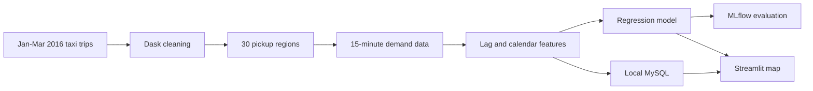

# NYC Taxi Demand Prediction

A local machine-learning project that predicts yellow-taxi pickup demand across 30 New York City regions in 15-minute intervals.

The project uses Dask for large-scale data processing, DVC for reproducibility, MLflow for experiment tracking and model registration, MySQL for application data, and Streamlit for the interactive demand map.

Analysis On Map: 
<p align="center">
  
  
</p>

Demo Video: "C:\Users\gullu\uber_demand\demo_taxi_demand.mp4"
## Project workflow



## Dataset

The project uses January, February, and March 2016 files from the [NYC Yellow Taxi Trip Data dataset on Kaggle](https://www.kaggle.com/datasets/elemento/nyc-yellow-taxi-trip-data).

The three files contain approximately 34.5 million trips. Raw CSVs are not stored in Git because they are several gigabytes.

Required files:

```text
data/raw/yellow_tripdata_2016-01.csv
data/raw/yellow_tripdata_2016-02.csv
data/raw/yellow_tripdata_2016-03.csv
```

## Exploratory data analysis

The Dask-based analysis is preserved in `notebooks/`. It explores schema, missing values, vendors, passenger counts, trip distance, fares, rate codes, coordinates, and pickup patterns by date, hour, and day of week.

Main findings:

- No missing values were reported in the selected analysis fields.
- Trip distance was strongly right-skewed: the median was 1.93 miles and the 90th percentile was 8.30 miles, but the maximum was an invalid 19,072,628.8 miles.
- Fare amount had similar outliers: the median was $10 and the 90th percentile was $27, while the maximum was $429,496.72.
- Pickup and drop-off coordinates contained values outside New York City.
- Passenger counts outside the expected 1-5 range were identified, although passenger count is not used by the final model.
- Pickup volume showed clear time-based structure, supporting a regional time-series forecasting approach.

The cleaning stage retains trips within these ranges:

| Field | Retained range |
|---|---:|
| Latitude | 40.60 to 40.85 |
| Longitude | -74.05 to -73.70 |
| Fare amount | $0.50 to $81.00 |
| Trip distance | 0.25 to 24.43 miles |

After filtering, 33,234,199 trips remain.

## Modeling

Pickup coordinates are standardized and divided into 30 regions using `MiniBatchKMeans`. Demand is then aggregated into 15-minute intervals for each region.

The model features are:

- demand from the previous four intervals (`lag_1` to `lag_4`);
- a shifted exponentially weighted pickup average;
- region ID; and
- day of week.

January and February provide 172,680 training rows. March provides 89,280 chronological test rows.

The final training pipeline uses:

- `StandardScaler` for coordinates;
- `MiniBatchKMeans` for the 30 geographic regions;
- `OneHotEncoder` for region and day-of-week categories; and
- `LinearRegression` for demand prediction.

MAPE is used as the evaluation metric. The current local DVC reproduction reports a test MAPE of approximately 30.69%. The preserved baseline notebook contains an earlier 7.93% result, so matching the notebook and pipeline results is an identified area for further investigation.

## DVC pipeline

The complete workflow is defined in `dvc.yaml`:

1. `data_ingestion` — reads the three CSVs and removes invalid trips.
2. `extract_features` — creates the 30 regions and regional demand series.
3. `feature_processing` — adds lag/calendar features and creates train/test data.
4. `train` — trains and saves the encoder and regression model.
5. `evaluate` — calculates MAPE and logs the run to MLflow.
6. `register_model` — registers the model in the local MLflow registry.

Clustering and EWMA parameters are stored in `params.yaml`. Generated data and model artifacts are tracked by DVC using the local, Git-ignored remote at `.dvc/local-storage`.

## Streamlit and MySQL

MySQL stores only the data required by Streamlit:

| Table | Contents |
|---|---|
| `app_locations` | 15,000 representative map coordinates and region IDs |
| `demand_features` | 89,280 March timestamps and model features |

The trained scaler, clusterer, encoder, and regression model remain local Joblib files under `models/`.

## Local setup

### 1. Create a Python environment

```powershell
py -3.13 -m venv .venv
.\.venv\Scripts\Activate.ps1
python -m pip install --upgrade pip
pip install -r requirements.txt
```

### 2. Configure MySQL

Copy `.env.example` to `.env` and update the values for your local server:

```dotenv
MYSQL_HOST=127.0.0.1
MYSQL_PORT=3306
MYSQL_DATABASE=uber_demand
MYSQL_USER=uber_app
MYSQL_PASSWORD=replace-with-a-local-password
MLFLOW_TRACKING_URI=sqlite:///mlflow.db
```

Create a dedicated MySQL user instead of using `root`:

```sql
CREATE DATABASE IF NOT EXISTS uber_demand;
CREATE USER IF NOT EXISTS 'uber_app'@'127.0.0.1'
  IDENTIFIED BY 'replace-with-a-local-password';
GRANT ALL PRIVILEGES ON uber_demand.*
  TO 'uber_app'@'127.0.0.1';
FLUSH PRIVILEGES;
```

### 3. Build the project artifacts

Place the three downloaded CSVs in `data/raw/`, then run:

```powershell
dvc repro
python scripts/build_plot_data.py
dvc add data/external/plot_data.csv
dvc push
```

### 4. Load MySQL and run Streamlit

```powershell
python scripts/load_mysql_data.py
streamlit run app.py
```

Open `http://127.0.0.1:8501` and select a March 2016 date and time.

### 5. View MLflow

```powershell
mlflow ui --backend-store-uri sqlite:///mlflow.db
```

## Continuous integration

GitHub Actions runs on pushes and pull requests using Python 3.12. It installs `requirements-dev.txt`, runs Ruff syntax/undefined-name checks, and runs Pytest.

```powershell
pip install -r requirements-dev.txt
ruff check --select E9,F63,F7,F82 .
pytest -q
```

## Security

- MySQL credentials are loaded from `.env` and are not hardcoded.
- `.env`, `.env.*`, local databases, raw data, the virtual environment, and local DVC storage are ignored by Git.
- `.env.example` contains placeholders only.
- Use a dedicated MySQL user with access only to `uber_demand`.
- Rotate any password that has been shared outside your local machine.

## Project structure

```text
app.py                       Streamlit application
scripts/                     Map-data and MySQL loading scripts
src/data/                    Dask ingestion and cleaning
src/features/                Clustering and feature engineering
src/models/                  Training, evaluation, and MLflow registration
notebooks/                   EDA and modeling notebooks
tests/                       Model and registry tests
data/ and models/            DVC-managed artifacts
dvc.yaml / dvc.lock          Reproducible pipeline
params.yaml                  Pipeline parameters
requirements*.txt            Runtime and development dependencies
```
